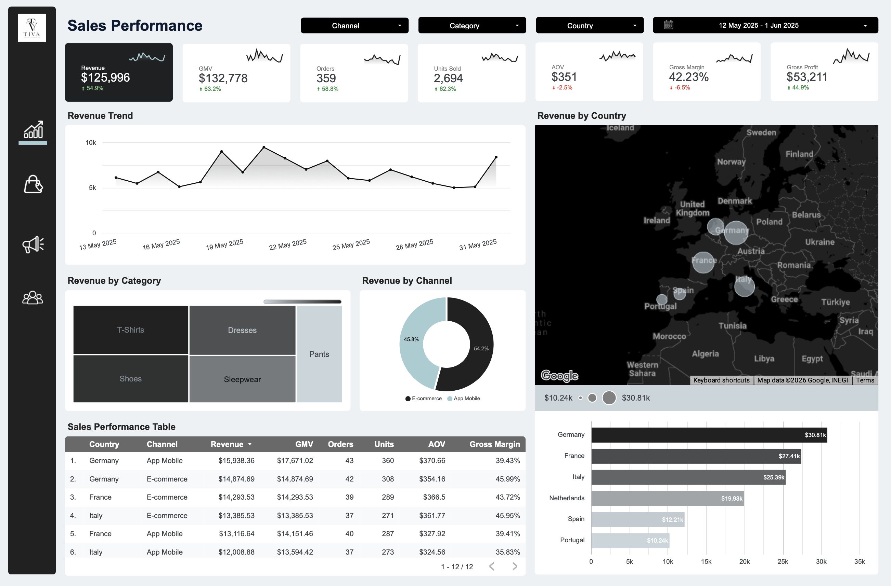
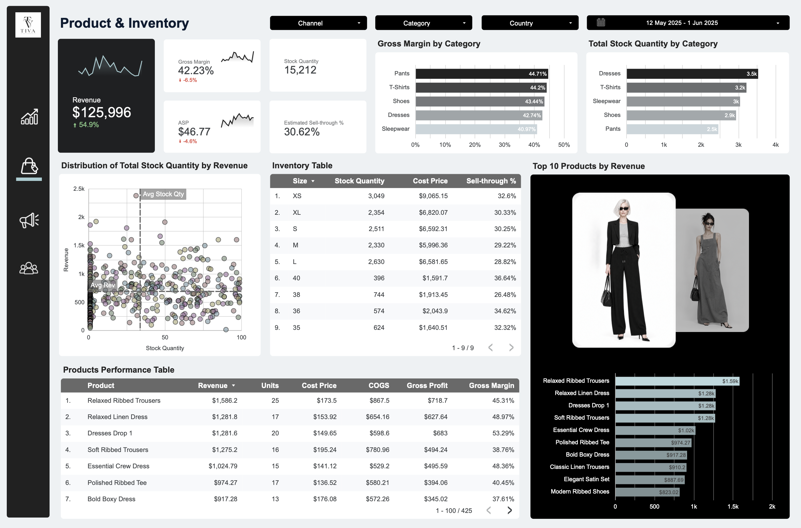
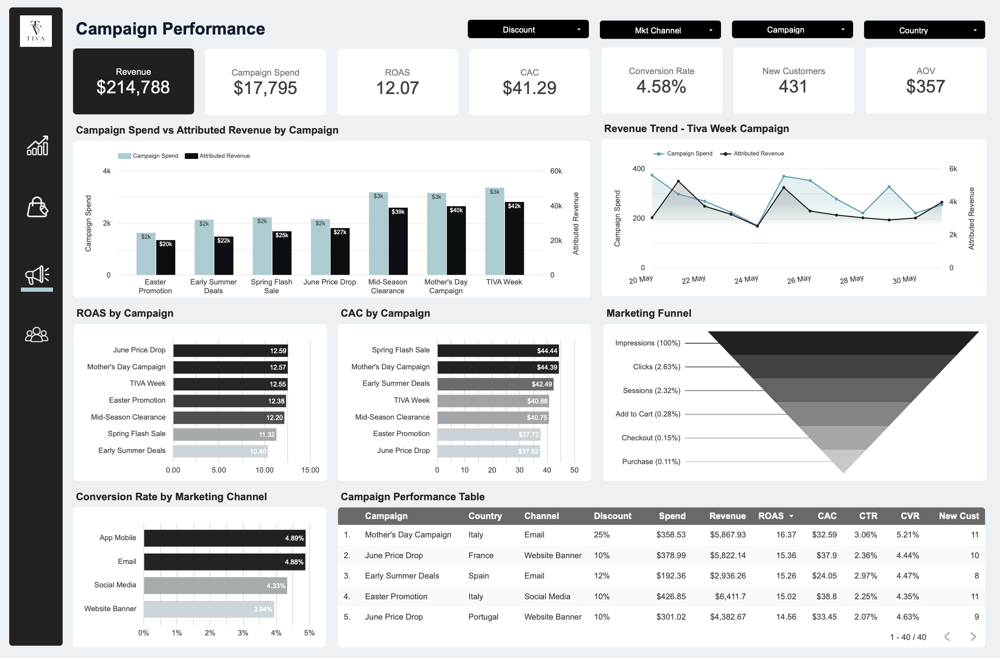
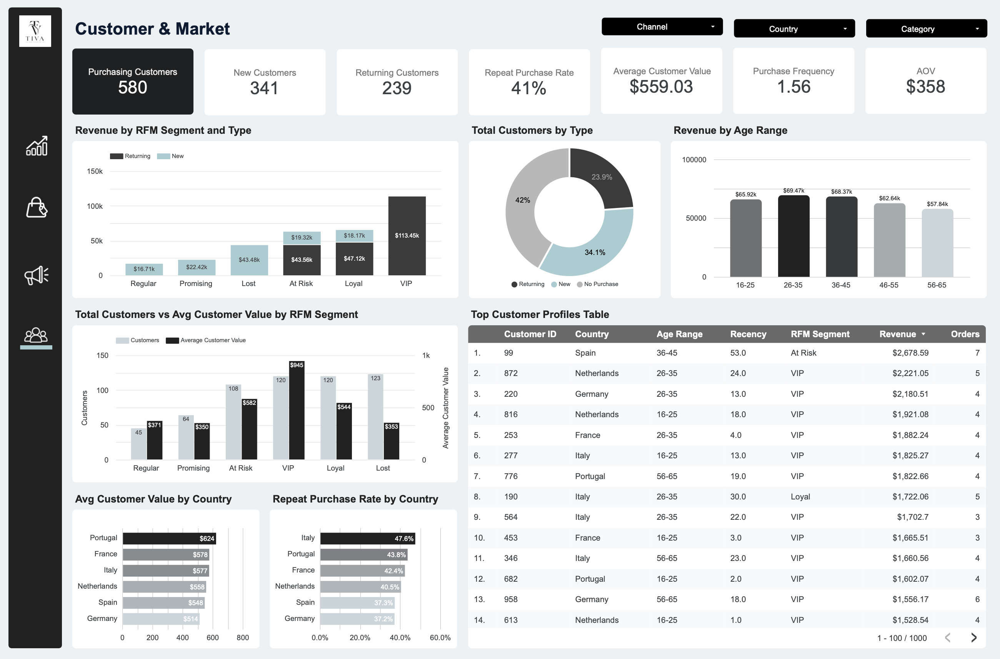

# TIVA Fashion Commerce — E-Commerce Analytics

An end-to-end analytics project that turns a multi-table European fashion e-commerce dataset into a decision-ready four-page Looker Studio dashboard and a case-study report — covering the full workflow from data cleaning and validation in Python, to KPI engineering and RFM segmentation, to visualization and business storytelling.

---

## Overview

TIVA is a premium fashion brand selling online across six European markets. The business wanted to understand its commercial performance and answer three questions it couldn't see clearly: **which campaigns actually pay back, how its six markets really differ, and whether heavy discounting is building loyal customers or just buying one-time sales.**

This project answers those questions across four analytical lenses — sales performance, product & inventory health, campaign efficiency, and customer value — delivered as an interactive dashboard supported by a written case study. The emphasis is on turning raw commerce data into clear, defensible business decisions, not just charts.

---

## Dashboard Preview

📄 **[View the case study (PDF)](Fashion_Commerce_Case_Study.pdf)** — all four pages plus insights and recommendations, no login needed.

**Page 1 — Sales Performance** *(How is the business trading right now?)* — rolling 3-week window

**Page 2 — Product & Inventory** *(What's making money, and is our stock healthy?)*

**Page 3 — Campaign Performance** *(Which campaigns are worth the spend?)* — sliced by campaign

**Page 4 — Customer & Market** *(Who's worth keeping, and how do markets differ?)* — all-time view

---

## Dataset

- **Source:** [European Fashion Store — Multi-table Dataset (Kaggle)](https://www.kaggle.com/datasets/joycemara/european-fashion-store-multitable-dataset), extended with a **synthetic campaign-marketing dataset** built for this project.
- **Structure:** multi-table — sales/orders, products, inventory, and customers, plus a daily campaign-marketing table.
- **Grain:** order-line level for sales; daily level (per campaign, channel, country) for marketing.
- **Fields:** order & customer IDs, order date, country, product hierarchy (category → product) and size, financials (quantity, sales, discount, cost, gross profit/margin), customer attributes (age range, RFM segment, recency), and campaign fields (spend, impressions, clicks, funnel stages, ROAS, CAC, discount type/value).
- **Markets:** Spain, Portugal, the Netherlands, Italy, Germany, France.
- **Period:** 2025 · **Currency:** USD
- **Context:** premium direct-to-consumer fashion e-commerce.

> **Note on the synthetic extension:** the Kaggle source has no campaign/marketing table, so a daily campaign dataset was generated to enable funnel, ROAS, and CAC analysis. It reuses the original campaign IDs, channels, and periods, and its unit economics (AOV, gross margin, units-per-order) are calibrated to the source data so the two reconcile. It is clearly labelled as synthetic throughout.

---

## Tools

| Stage | Tool |
|-------|------|
| Cleaning & validation | Python (pandas, VS Code) |
| Transformation & KPI engineering | Python (pandas) |
| Customer segmentation (RFM) | Python (pandas) |
| Synthetic campaign extension | Python |
| Dashboard & measures | Looker Studio |
| Report / case study | Canva + Markdown |

---

## Business Questions

1. **Sales** — How is the business trading over the recent period, across revenue, order value, margin, and market?
2. **Product & Inventory** — Which products and categories make money, and is stock selling through healthily?
3. **Campaign** — Which campaigns generate enough revenue and profit to justify their spend, and where does the funnel leak?
4. **Customer & Market** — Who are our most valuable customers, are we keeping them, and how do the six markets differ in value and loyalty?

---

## Data Preparation

1. **Data profiling** — checked keys, missing values, duplicates, value ranges, and table relationships across the multi-table source.
2. **Data cleaning** — standardised dates, discounts, prices, and categorical fields in Python (pandas).
3. **Data validation** — reconciled sales totals and verified foreign-key consistency across tables.
4. **Data transformation** — built analysis-ready datasets for sales, products, customers, inventory, and campaigns.
5. **KPI engineering** — calculated GMV, AOV, ASP, Gross Margin, Sell-through, ROAS, CAC, CTR, Conversion Rate, and customer metrics.
6. **Customer segmentation (RFM)** — scored customers on Recency, Frequency, and Monetary value and mapped them to named segments (VIP, Loyal, At-Risk, Promising, Regular, Lost); added repeat-rate and purchase-frequency measures.
7. **Synthetic campaign extension** — generated daily campaign spend and funnel data using the original campaign IDs, channels, and periods (see dataset note above).
8. **BI modelling** — connected the prepared datasets to Looker Studio and built the four-page interactive dashboard, each page scoped to its own decision horizon (Sales = rolling 3 weeks, Campaign = by campaign, Customer = all-time).

---

## Analysis & Insights

### Page 1 — Sales Performance *(recent 3-week trading)*

- **Growth is strong but volume-led.** Revenue is up **+54.9%** and orders **+58.9%**, but average order value fell **−2.5%** and gross margin **−6.5%** — units are growing faster than revenue.
- **The core tension:** selling more while keeping less of each dollar is the signature of **discount-led growth** — the brand is buying growth, not earning it.
- **Markets are uneven.** Germany leads at **~$30.8K**, roughly **3×** Portugal's **~$10.2K** — a single commercial strategy is being applied to very different markets.

### Page 2 — Product & Inventory

- **The brand is sitting on overstock.** Estimated sell-through is **30.6%**, against a healthy fashion range of **60–80%** — and below the **40%** overstock warning line *(benchmarks: Toolio, Shopify)*.
- **The size curve is mis-bought.** Core sizes (S/M/L) and XS were over-bought, all selling through in the high-20s to low-30s; size **38** is worst at **26%**. Falling ASP (**−4.6%**) shows stock is increasingly being marked down to move.
- **Pants is a hidden opportunity.** It earns the **highest margin (44.7%)** on the **lowest revenue (~$24K)** and the **least stock** — likely because it is the least-discounted, least-overstocked category. The same discount effect eroding margin elsewhere, seen from the product side.

### Page 3 — Campaign Performance *(by campaign)*

- **Campaigns are efficient overall** — a blended **12.07 ROAS** and **$41.29 CAC**.
- **But deeper discounts don't perform better.** The most efficient campaign, **June Price Drop, is only 10% off** — highest ROAS (**12.59**) and lowest CAC (**$37.62**) — beating the 30%-off campaigns (TIVA Week, Mid-Season Clearance at 12.55 / 12.20). Deep discounts give away ~3× the margin for no efficiency gain.
- **The funnel leaks at the shelf, not checkout.** The biggest drop is **Sessions → Add to Cart (2.32% → 0.28%, ~88%)** — a product-page/offer problem, not payment friction.

### Page 4 — Customer & Market *(all-time)*

- **A small segment drives most revenue.** **VIPs (120 customers)** generate **~35% of revenue** — roughly a fifth of buyers producing a third of the top line.
- **A third of revenue is slipping away.** **At-Risk (108) + Lost (123) customers hold ~$106K (~33% of revenue)** — and At-Risk is the **second most valuable** segment, so it's high-value customers drifting.
- **Loyalty is wildly uneven by market.** Italy retains at **47.6%**; Germany — the biggest market — is worst at **37.2%** and has the lowest customer value (**$514** vs Portugal's **$624**).

### 🔑 The key insight (cross-page)

> **TIVA spends the most, and discounts the hardest, to acquire the customers worth the least.** Germany is the biggest market and biggest source of discount-driven new customers, yet has the lowest customer value and lowest loyalty; Portugal is the mirror image. This matches established research — deep acquisition discounts (30%+) are linked to substantially lower customer lifetime value *(Lewis, 2006; DTC benchmarks)*.

---

## Recommendations

- **Discipline the discount.** Cap standard promotions at **10–15%**; reserve 25–30% strictly for genuine end-of-life clearance. Redirect saved margin into value-adds (free-shipping thresholds, gift-with-purchase, early access) that lift orders without training customers to wait for sales. Track a **discount-dependency ratio** (discounted revenue ÷ total) and hold it under **25%**.
- **Rebalance market investment.** Run a two-track strategy: in **Germany**, pivot spend from acquisition discounting to **retention** (second-purchase triggers, post-purchase flows); in **Portugal, Italy, and the Netherlands**, **increase acquisition**, since those markets turn buyers into repeat, high-value customers.
- **Stand up a retention & loyalty engine.** A structured **3-email win-back** sequence for At-Risk/Lost, a **tiered VIP/loyalty program** (points, early access, member pricing instead of blanket discounts), and a **second-purchase nudge** for the 34% of customers who are New — since first-to-second order is the highest-leverage step.
- **Clear overstock and fix the buy.** Mark down slow sizes (XS, size 38) and slow categories to free working capital, route clearance *through* the deep-discount campaigns (their proper purpose), and correct the size curve on the next buy.
- **Fix the browse-to-cart leak.** Because the funnel breaks at Sessions → Add to Cart, prioritise product-page improvements (imagery, size guidance, social proof, clearer pricing) over checkout tweaks.

**What good looks like next quarter:** discount dependency **< 25%** · Germany repeat rate rising toward the **41%** portfolio average · sell-through recovering toward **60%** · blended margin back above **45%**.

---

*Built as a portfolio project demonstrating the full analytics workflow — data cleaning and validation, RFM segmentation, KPI design, dashboard design, and business storytelling — with honest handling of data limitations (e.g. the synthetic campaign extension is clearly labelled, and metrics that the data can't support were cut rather than faked).*
